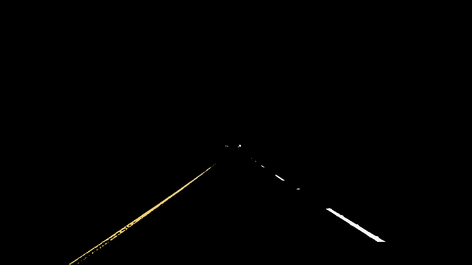
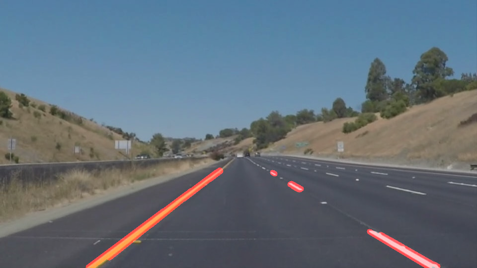
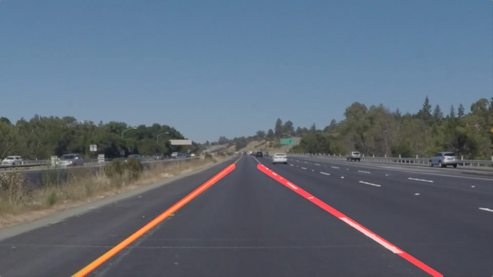

# **Project 1** 

## Finding Lane Lines on the Road

### This project contains the scope of work and the desired solutions.

---
### Introduction

**Prerequisite**
Having jupyter installed be able to run notebook (.ipynb)
or be able to get content from a specif cell type code
and run it in python (look for code cells below "SOLUTION FOR IMAGES"
and "SOLUTION FOR VIDEO" while last one depends on three steps:
1. import Video and HTML related stuff
2. a function to process (single frames of) a video
3. read the video, process the frames and create an output file

---
**Finding Lane Lines on the Road**

Description:
!Each code cell from the solutions has extended documentation per step, too.!

When we look at a picture our brain has already developed technics to identify
a lot of information from it. In general it is trivial for us to see colors, brightness,
shapes, depth differences, sharp parts, blurry parts - just to name a few.

A computer with its smallest arbitrable decisions on/off, yes/no or 1/0 must use
other possiblites to mimic or converge the human processes.

In one sentence summariezd a computer program needs to differentiate colors, identify where
strong changes in brightness happens (called edges), limit the area where to look at and
if a aggregation of points could be an indication of a straight line.
We achieve this by using some well knwon mathematical technics, some already available code libraries
that are just feed on data like parameters. And last but not least we do some tweaks by changing values 
back and forth or we use trial and error.

---
### Reflection

### 1. A) SOLUTION FOR IMAGES

To demonstrate this lets have a look a the following picture and how we can work with it as source.

COLOR SELECTION, REGION OF INTEREST and MASKING

Since the source can be seen as multi-dimensional matrix with of values in a range, that represent 
brightness and color space,we can select our desired range that will be considered and can identify
the lanes next to other bright values in the scene. A shape of polygon can be drawn and specifies
where we want to look at in detail while the rest of the picture is maseked to 0 values.Here the 
yellow solid is in the result like the dashed lane as well.

CANNY EDGES

With the help of some algorithm called Canny we can
A) reduce the noise in the picture with a Gaussian filter. It will be blurred by that and 
decrease the amount "false" edges.
B) identify strong edges by looking for high peaks of value changes - the intensity gradients in this image.

HOUGH TRANSFORM

In simple words and without explaining the Hough space in detail we can apply this method to see, if lines 
are strongly pointing into the same direction and just display these line that satisfies the Hough conditions.
Here a lot tweaking is necessary, because a good result is very parameter depending and can differ 
from scene to scene. Here the Hough Transform is combined with the source image.

You can see that the lane is detected, but with one drawback. The dashed line is identified, but it would be better
to let the computer see the lane in better way like two solid lines. For this improvement is necessary to
work with the characteristics of linear functions and how to apply these to attempt to display and find a solid lane.
We need to draw the lines on the line_image separately by looking for a positive and a negative slopes for each curb.
This is done by linear regression and we define some boundary values to exlcude lines that are out of our interest.
Furthermore we need to exclude special cases like x1 == x2 which cannot be a linear function and is not usable for us.
The lane is separated by left and right by defining the center of the image and considering slopes just  for each half
of the image. The start and endpoint of each curb is the bottom of the image and extends out to a special height in the
image which shapes it like an unfinished trapezoid and culminates into the final result.

You can compare this one out of six source images with the different methods to the final result in folder:
[test images](https://github.com/auto-ctec/ComputerVision-Finding-LaneLines-Project/tree/master/test_images_output)

---
### 1. B) SOLUTION FOR VIDEOS

The same methodologies from single image solution apply here as well. 
The difference is that video is separated e.g. into 600 frames and each frame will be processed
to find the respective lane. Afterwards the frames (with lanes) will be saved as a video again. 
You can watch the three videos in:
[test videos](https://github.com/auto-ctec/ComputerVision-Finding-LaneLines-Project/tree/master/test_videos_output)

---
### 2. Potential shortcomings with current pipeline

Traffic is very dynamic and there are plenty of (image) situations where the solutions might fall.
Weather conditions like rain and snow, construction work on the road, brightness issues (like happening
at first in the challenge video where very bright sections destroyed the lane detection and show hundreds
of dots beside some existing lines. Driving at night could be ok, if the lines reflect the car lights.
If the turn is to sharp within the road the line detection might fail. The pocessing of the videos takes
to much time and might be insufficient for real-time applications. 
A hill will result in a short amount of time without lane detection. I had this issues once with a Tesla Model S
in Germany at while driving along a slope at the [google maps position]
(https://www.google.de/maps/place/16356+Ahrensfelde/@52.5875962,13.5881158,15.65z/data=!4m5!3m4!1s0x47a84b4f1eeb6e1d:0x42120465b637400!8m2!3d52.5817191!4d13.5747926)
with about 75 km/h. To fast for the activated autopilot and the following lane detection correction with 
almost slipping and leaving the road.

---
### 3. Suggest possible improvements to your pipeline

The parameters that can be tweaked are static, if the solution is used for now.
They should be handled more dynamically to react on different conditions. Maybe
hepler functions could survey the parameters for Canny or Hough and tweak, if some cases.
The region of interest should be improved. The code cells in general should be separated to have better overview and
"hide" undesirable blocks of plain data.
